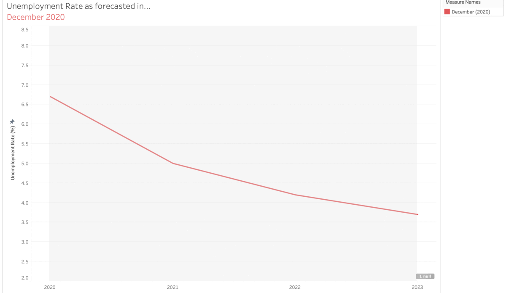

# Critique and Redesign 

All of us are familiar with the use of graphics and visualizations for news stories, sporting events, social media posts, and so on. All of us are also familiar with the confusion and feeling of 'Huh?' that comes with a poorly designed visualization. As a data scientist, I myself have designed many poor visualizations as  it is very easy to get caught up on the analysis and broader story you're trying to tell. Furthermore, fine-tuning a graphic can be tedious and hardwork even with the most advanced visualization packages. 

## Step 1: Find a Visualization 

One way in which I try and stay up-to-date on daily news is by signing up for a variety of newsletters. These newsletters offer condensed versions of the day's top stories usually coupled with expert commentary and an associated graphic. In one such newsletter -  Wall Street Journal's Real Time Economics - offers fantastic insight and constant economic news. However, I noticed a graphic in a recent special edition that could use some tweaking. 

The crux of the article is centered around the idea that the Federal Reserve offers forecasts on the unemployment rate multiple times a year. More specifically, the graphic is attempting to communicate that those forecasts often drop, resulting in a better than expected labor market. 

## Step 2: Critique the Visualization 

What stood out to me was the intended split of the line graph between pre-2020 and post-2020. To me, the split of the lines certainly felt like it was supposed to convey something; however, I could not easily tell what it was supposed to convey. The colors also add to the confusion, as all the colors are too similar to easily discern which is which. The mismatch of lengths (for actual vs forecasts) also is a bit jarring and confusing. I would split this visualization up and only focus on the stretch the article intends to: 2020-2021. As stated in our workbook, I feel like removing some aspects could help tailor the visualization to a better understanding. I would move away from a static visualization and make an animated gif of the trend. This technique would be highly effective as the author intends the audience to focus on the trend over time, and there's no better way to show the passing of time than using an animation. 

The article and visualization are from the Wall Street Journal's Real Time Economics email list, which sends out daily news updates on all things economics related. The primary audience is used to seeing highly technical economics visualizations and data. To some extent, this visualization is not terrible because economists tend to not really need "good" graphics to get the point (unlike, say, a newspaper trying to get the readers' attention). However, to open the understanding of the topic up to a wider audience, this graphic certainly needs a revision. I have a passion for putting "hard to understand" topics in easy to understand terms, and this is a prime example of implicit & unintentional academic gatekeeping.  

## Step 3: Wireframe a Solution 

Wireframing, for me, is the hardest part of the critique & improvement phase of data visualization. First, it's difficult to fully express your ideas and thoughts on a piece of paper. I have terrible handwriting and drawing skills, so relying on physical wireframes has required me to put more effort into those skills. Being able to quickly and efficiently explain new ideas to colleagues and clients through quick sketches is vital to data visualization. Second, being able to turn a wireframe into a finished design is harder than I expected it to be. You may have the best idea in the world, but if your preferred visualiation tool does not have the capability you desire than you either must find (and learn) one that does or make it yourself. 

In this case, I designed the wireframe for my final animation on my iPad utilizing the Notability app for design. I came up with two potential final products before deciding on the animation route. Below is the first wireframe. 

In this wireframe, I attempted to keep all the forecasted unemployment rates on a singular graph. By removing the years considered, I was able to condense the information and make it more readible. I also attempted to increase the viewability by switching from lines to dots. All in all, I decided this approach did not do enough to alleviate the problems of the original graph as the overlapping points made it confusing to read. 

The second wireframe shows my planned animation (1-6). I split each forecast into its own graph, highlighting the pertinent month each iteration. The flow allows the viewer to easily see the change in forecast while still maintaining the full effect. 

## Step 4: Test the Solution 

In order to get a better understanding of how my wireframed solution tested among the average viewer, I enlisted the help of some friends and family. I asked some broad questions, including: 

- Can you tell me what you think this is?

- Can you describe to me what this is telling you?

- Is there anything you find surprising or confusing?

- Who do you think is the intended audience for this?

- Is there anything you would change or do differently?

The goal of this phase was to get raw feedback on the formatting of the solution. Without offering more context or background, the responses act as a proxy for what the average viewer will think when they see my solution. 

Overall, the responses from my interviews were very mixed. The primary response to my wireframe was one of confusion. However, the confusion was not about the information but about the nature of the final product. Most of the people I interviewed could not easily see that graphs 1-6 were meant to be shown immediately after each other as an animation. As a result, a few told me that there were too many graphs and they didn't know where to look first. Additionally, others thought it was too hard to read each individual graph because they were too small. Other feedback at this stage included using better titles to explain the purpose of the graph and to add a legend. 

Luckily for my project, Professor Chris Goranson offered some in-class time to do a group critique of our final products. My teammates were able to see an updated version of my wireframe which more easily communicated the animation aspect. From the group, I learned to include more tick marks for readibility and to include shading of the forecasted period. 

## Step 5: Final Visualization 

Above is my suggestion to the WSJ's Real Time Economics author for the visualization. The animation works well for the intended audience, as the trend is very easy to see and (most importantly) does not take much of the viewer's time. The gif cycles in about 5 seconds, communicating the message in less time than it would take the average viewer to discern it from the provided graph. The color highlights the trend and matches the change in title as the animation progresses. 

Source: WSJ Real Time Economics Special Report: Labor Market Powers Through Omicron (02/04/2022) 
Source: Federal Reserve Summary of Economic Projections, https://www.fedsearch.org/fomc-docs/search?text=summary+of+economic+projections

